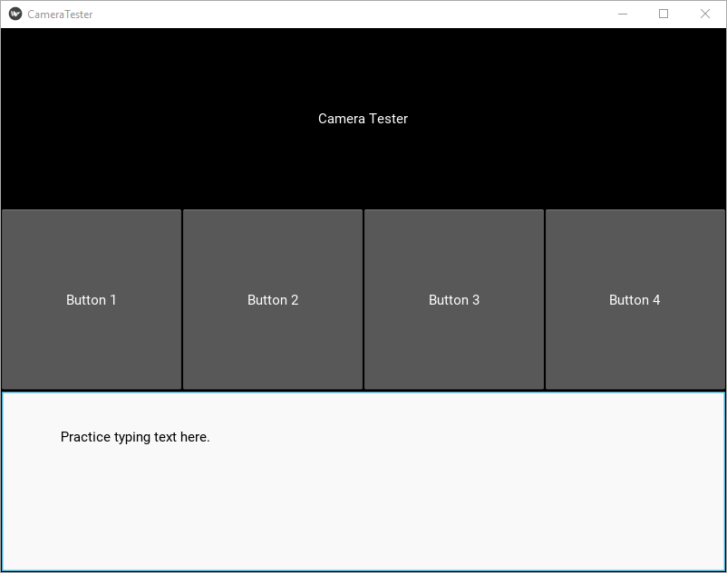

# Kivy Lesson

## Blank Screen

Default size.

    from kivy.app import App
    App().run()

## Create Class

    class CameraTester(App):
        pass

Run app using name of class.

    CameraTester().run()

## Create new kivy language file

The file name must be the same as the class name with a *.kv* extension *cameratester.kv*. 

    Label: 
        text: "Camera Tester"

## Add Grid Layout In Python

in Python file

    from kivy.uix.gridlayout import GridLayout
    
    class MainScreen(GridLayout):
        pass

## Add Root Object

in kv file

    <MainScreen>:
    MainScreen:

        Label: 
            text: "Camera Tester"

## Add Rows

In kv file, under MainScreen:

    rows: 4

## Add BoxLayout for Second Row

Add four buttons in kv file

    BoxLayout:
        orientation: "horizontal"
        Button:
            text: "Button 1"
        Button:
            text: "Button 2"
        Button:
            text: "Button 3"
        Button:
            text: "Button 4"

## Add Input Box

In kv file

    TextInput:

## Add Output Box

Use **Label** to create the output box.

    Label:
    text: "this is the bottom output box"

## Add 5th row

* Add another row
* Create a horizontal box for the 5th row
* Add Slider:
* Add Switch:
* Add Image:
** Source: "filename.png"

